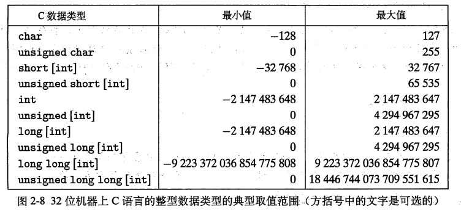

[TOC]

## 一. 计算机系统漫游
### 1.1 信息就是位 + 上下文
源程序实际上就是一个由值0和1组成的位(bit)序列，8个位被组织成一组，称为字节。每个字节表示程序中某个文本字符。
大部分的现代系统都使用ASCCI标准来表示文本字符，这种方式实际上就是用一个唯一的
 **单字节** 大小的整数值(8个位可义表示的正数范围0~255)来表示每个字符。  
```c
#include <stdio.h>
int main()
{
    printf("hello world\n");
}
```

>以最简单的helloworldC程序为例:第一个字节的整数值是35，它对应的就是字符‘#’；
第二个字节整数值为105，它对应的字符是‘i’,依次类推。注意，每个文本行都是以一个
不可见的换行符'\n'来结束的，它所对应的整数值为10。像he11o.c这样只由ASCI字符
构成的文件称为``文本文件``，所有其他文件都称为``二进制文件``。

hel1o.c的表示方法说明了一个基本的思想：系统中所有的信息一包括磁盘文件、存储器中的程序、存储器中存放的用户数据以及网络上传送的数据，都是由一串位表示的。区分不同数据对象的唯一方法是我们读到这些数据对象时的 <mark> 上下文 </mark>。  比如，在不同的上下文中，一个同样的字节序列可能表示一个整数、浮点数、字符串或者机器指令。

### 1.2 程序被其他程序翻译成不同的格式
hello.c的文本程序文件能够被人们读懂,然而如果要在系统上运行,必须被其他程序转化为一些列的低级 <mark> 机器语言指令 </mark>.
在Uix系统上，从源文件到目标文件的转化是由编译器驱动程序完成的：
```bash
unix>gcc -o hello hello.c
```
在这里，GCC编译器驱动程序读取源程序文件he11o.c,并把它翻译成一个可执行目标文件he11o。这个翻译的过程可分为四个阶段完成，如图1-3所示。执行这四个阶段的程序（预处理器、编译器、汇编器和链接器)一起构成了编译系统(compilation system)。


- **预处理阶段。**  
预处理器（cpp）根据以字符#开头的命令，修改原始的C程序。比如hello.c中第1行的#include <stdio.h>命令告诉预处理器读取系统头文件stdio.h的内容，并把它直接插人到程序文本中。结果就得到了另一个C程序，通常是以 .i 作为文件扩展名。
- **编译阶段。**  
编译器（cc1）将文本文件hello.i翻译成文本文件hello.s，它包含一个汇编语言程序。汇编语言程序中的每条语句都以一种标准的文本格式确切地描述了一条低级机器语言指令。汇编语言是非常有用的，因为它为不同高级语言的不同编译器提供了通用的输出语言。例如，C编译器和Fortran编译器产生的输出文件用的都是一样的汇编语言。
- **汇编阶段。**  
接下来，汇编器（as）将hello.s翻译成机器语言指令，把这些指令打包成一种叫做可重定位目标程序（relocatable object program）的格式，并将结果保存在目标文件hello.o中。hello.o文件是一个二进制文件，它的字节编码是机器语言指令而不是字符。如果我们在文本编辑器中打开hello.o文件，看到的将是一堆乱码。
- **链接阶段。**  
请注意，hello程序调用了printf函数，它是每个C编译器都会提供的标准C库中的一个函数。
printf函数存在于一个名为printf.o的单独的预编译好了的目标文件中，而这个文件必须以某种方式合并到我们的hello.o程序中。链接器（ld）就负责处理这种合并。结果就得到 hello 文件，它是一个可执行目标文件（或者简称为可执行文件），可以被加载到内存中，由系统执行。

### 1.4 系统硬件组织  
#### 1.4.1 *字* 的概念  
  

- 总线  
    贯穿整个系统的是一组电子管道，称做总线  
    它携带信息字节并负责在各个部件间传递。 <mark> 通常总线被设计成传送定长的字节块，也就是 **字**（word） </mark>。字中的字节数（即字长）是一个基本的系统参数，在各个系统中的情况都不尽相同。现在的大多数机器字长有的是4个字节（32位），有的是8个字节（64位）。为了讨论的方便，假设字长为4个字节，并且总线每次只传送1个字。

- 内存  
    主存是一个临时存储设备，在处理器执行程序时，用来存放程序和程序处理的数据。从物理上来说，主存是由一组动态随机存取存储器（DRAM）芯片组成的。从逻辑上来说，<mark> 存储器是一个线性的字节数组，每个字节都有其唯一的地址（即数组索引） </mark>，这些地址是从零开始的。一般来说，组成程序的每条机器指令都由不同数量的字节构成。与C程序变量相对应的数据项的大小是根据类型变化的。例如，在运行Linux的IA32机器上，short类型的数据需要2个字节，int、float 和 long类型需要 4 个字节，而 double 类型需要 8 个字节。

- 高速缓存存储器  
    处理器从内存读取数据的速度比从硬盘读取的速度快1000万倍, 处理器从寄存器读取的速度比从内存读取的速度快100倍, 尽管如此, 寄存器的存储空间太有限了,只有几千字节, 基于此系统设计者采用了更小更快的存储设备 <mark> 高速缓存存储器 </mark> 作为缓存用来存放处理器近期可能用到的数据, L1和L2高速缓存是用一种叫做静态随机访问存储器（SRAM）的硬件技术实现的。比较新的、处理能力更强大的系统甚至有三级高速缓存：L1、L2和L3。

## 二. 信息的表示和处理
### 2.1 信息存储
大多数计算机使用8位的块，或者字节(byte),作为最小的可寻址的内存单位，而不
是访问内存中单独的位。机器级程序将内存视为一个非常大的字节数组，称为虚拟内存
(virtual memory)。内存的每个字节都由一个唯一的数字来标识，称为它的地址(ad
dress),所有可能地址的集合就称为虚拟地址空间(virtual address space)。  
在接下来的几章中，我们将讲述编译器和运行时系统是如何将存储器空间划分为更可
管理的单元，来存放不同的程序对象(program object),即程序数据、指令和控制信息。
可以用各种机制来分配和管理程序不同部分的存储。这种管理完全是在虚拟地址空间里完
成的。例如，C语言中一个指针的值（无论它指向一个整数、一个结构或是某个其他程序
对象)都是 <mark> 某个存储块的第一个字节的虚拟地址 </mark>某个存储块的第一个字节的虚拟地址。C编译器还把每个指针和类型信息联系
起来，这样就可以根据 <mark> 指针值的类型 </mark>，生成不同的机器级代码来访问存储在指针所指向位置
处的值。尽管C编译器维护着这个类型信息，但是它生成的实际机器级程序并不包含关于数
据类型的信息。每个程序对象可以简单地视为一个字节块，而程序本身就是一个字节序列。  

#### 2.1.2 字数据大小  
每台计算机都有一个字长(word size），指明指针数据的标称大小(nominal size)。因为虚拟地址是以这样的一个字来编码的，所以字长决定的最重要的系统参数就是 <mark> 虚拟地址空间的最大大小 </mark>(0x00000000~0xFFFFFFFF)。也就是说，对于一个字长为 w 位的机器而言，虚拟地址的范围为0～2<sup>w-1</sup>，程序最多访问2<sup>w-1</sup>个字节。 
最近这些年，出现了大规模的从 32 位字长机器到 64 位字长机器的迁移。32位子长限制虚拟地址空间为4千兆子节（写作4GB)，也就是说，刚刚超过4×10<sup>9</sup> 字节。扩展到64位字长使得虚拟地址空间为 16EB，大约是1.84×10<sup>19</sup> 字节。  

#### 2.1.3 寻址和字节编码  
对于跨越多字节的程序对象, 我么你必须建立两个规则: 这个对象的地址是什么,以及在内存中如何排列这些字节,通常多字节对象都被存储为连续的字节序列, 对象的地址就是所使用字节中最小的地址。排列表示一个对象的字节又两种规则: <mark> 大端法 </mark>和 <mark> 小端法 </mark>  
  
```c
#include<stdio.h>
typedef unsigned char *byte_ptr;
// 打印每个以16进制表示的字节
void show_bytes(byte_ptr start, int len) {
    int i;
    for (i = 0; i < len; i++)
    {
        printf("%.2x  ", start[i]);
    }
    printf("\n");
}
// 打印整数的字节表示
void show_int(int x){
    show_bytes((byte_ptr)&x, sizeof(int));
}
// 打印浮点行数据的字节表示
void show_float(float ft){
    show_bytes((byte_ptr)&ft, sizeof(float));
}
// 打印指针的字节表示
void show_pointer(void *x){
    show_bytes((byte_ptr)&x, sizeof(void *));
}

void test_show_byte(int val) {
    int ival = val;
    float fval = (float)ival;
    int *pval = &ival;
    printf("%x\n", pval);
    show_int(ival);
    show_float(fval);
    show_pointer(pval);
}
void main(){
    test_show_byte(12345);
}
```

- 原本预期的结果  

| 数据 | 类型 | 二进制 | 16进制 |
|:------:|:------:|:---------:|:---------:|
| 12345 | int | 00000000 00000000 00110000 00111001 | 00 00 30 39 |
| 12345.0 | float | 01000110 01000000 11100100 00000000 | 46 40 E4 00 |
| &ival | * int | 00000000 01100010 11111101 11011100 | 62 fd dc |

- 实际结果  

| 系统 | 数据 | 类型 | 二进制 | 16进制 |
|:------:|:------:|:------:|:---------:|:---------:|
| Linux32 | 12345 | int | 00111001 00110000 00000000 00000000  | 39 30 00 00 |
| Windows | 12345 | int | 00111001 00110000 00000000 00000000 | 39 30 00 00 |
| Sun | 12345 | int | 00000000 00000000 00110000 00111001 | 00 00 30 39 |
| Linux64 | 12345 | int | 00111001 00110000 00000000 00000000 | 39 30 00 00 |
||||||
| Linux32 | 12345.0 | float | 00000000 11100100 01000000 01000110 | 00 e4 40 46 |
| Windows | 12345.0 | float | 00000000 11100100 01000000 01000110 |00 e4 40 46 |
| Sun | 12345.0 | float | 01000110 01000000 11100100 00000000 | 46 40 E4 00 |
| Linux64 | 12345.0 | float | 00000000 11100100 01000000 01000110 | 00 e4 40 46 |
||||||
| Linux32 | &ival | * int | 4字节 | 00 e4 40 46 |
| Windows | &ival | * int | 8个字节 | dc  fd  62  00  00  00  00  00 |
| Sun | &ival | * int | 4字节 | 62 fd dc |
| Linux64 | &ival | * int | 8个字节 | dc  fd  62  00  00  00  00  00 |

如果我们将这些十六进制模式扩展为二进制形式，并且适当地将它们移位，  
我们就会发现一个有13个相匹配的位的序列，用一串星号标识出来：


#### 2.1.4 表示字符串  
C语言中字符串被编码为一个以null(值为0)的字符结尾的 <mark> 字符数组 </mark>,每个字符都由某个标准编码来表示, 最常见的是ASCII字符码。因此， 如果我们 以参数 ”
12345" 和 6（ 包括终止符）来运行例程 show_bytes , 我们得到结果 31 32 33 34 35 00。请注意，十进制数字'1'的 ASCII 码正好是 Ox31, 而终止字节的十六进制表示为 OxOO。 在使用 ASCII 码作为字符码的任何系统上都将得到相同的结果，与字节顺序和字大小规则无关。 因而，<mark> 文本数据比二进制数据具有更强的平台独立性 </mark>。  
```c
#include<stdio.h>
typedef unsigned char *byte_ptr;
// 打印每个以16进制表示的字节
void show_bytes(byte_ptr start, int len) {
    int i;
    for (i = 0; i < len; i++)
    {
        printf("%.2x  ", start[i]);
    }
    printf("\n");
}

// 打印字符串数据的字节表示
void main(){
    show_bytes("12345", 6); //31  32  33  34  35  00
}
```
##### 文字编码的Unicode标准
ASCII字符集适合于编码英语文档，但是在表达一些特殊字符方面却没有太多办法，它完全不适合编码希腊语和中文这样语言的文档。基本编码，也称为Unicode的“统一字符集”，使用32位来表示字符。这好像是要求文本串中每个字符要占用4个字节。不过，可以用一些替代编码，常见的字符只需要1个或2个字节，而不太常用的字符需要多一些的字节数。特别地，UTF-8表示将每个字符编码为一个字节序列，这样标准ASCII字符还是使用和它们在ASCII中一样的单字节编码，这也就意味着所有的ASCII字节序列用 ASCII码表示和用UTF-8表示是一样的。Java 编程语言使用 Unicode 来表示字符串。对于C语言也有支持 Unicode的程序库。  

#### 2.1.7 C语言中的位级运算
C语言支持按位布尔运算 <mark> |、&、~和^ </mark>：|就是OR(或)，&就是AND(与)，~就是NOT(取反)，而^就是EXCLUSIVE-OR（异或)。  
这些运算能运用到任何“整型”的数据类型上，也就是那些声明为
<mark> char或者int的数据类型 </mark>，无论它们有没有像short、long、longlong或者unsigned
这样的限定词。  
> 对于任一 位向量a, 有 a ^ a = 0  
> 对于任一 位向量a, 有 0 ^ a = a  
> 对于任何两个 位向量a,y, 有 x^y = (~x&y)|(x&~y) 

##### 掩码运算  
位级运算的一个常见用法就是实现掩码运算，.这里掩码是一个位模式，表示从一个字中选出
的位的集合。让我们来看一个例子，掩码0xFF(最低的8位为1)表示一个字的低位字节。位
级运算x&0xFF生成一个由x的最低有效字节组成的值，而其他的字节就被置为0。比如，对于
x=0x89 ABCDEF,其表达式将得到0x000000EF。表达式0将生成一个全1的掩码，不管机器
的字大小是多少。尽管对于一个32位机器来说，同样的掩码可以写成0XFFFFFFFF,但是这样
的代码不是可移植的。  

#### 2.1.8 C语言中的逻辑运算  
C语言还提供了一组逻辑运算符 <mark> ||、&&和！ </mark>，分别对应于命题逻辑中的OR、AND和NOT
运算。逻辑运算很容易和位级运算相混淆，但是它们的功能是完全不同的。逻辑运算认为所有非
零的参数都表示TRUE,而参数0表示FALSE。它们返回1或者O,分别表示结果为TRUE或者
为FALSE。  
逻辑运算符&&和‖与它们对应的位级运算&和|之间第二个重要的区别是，如果对第一个
参数求值就能确定表达式的结果，那么逻辑运算符就不会对第二个参数求值。因此，例如，表达
式a&5/a将不会造成被零除，而表达式p&&*p++也不会导致间接引用空指针。这一现象通常被叫做 <mark> 逻辑运算短路现象 </mark>。

#### 2.1.9 C 语言中的移位运算
C 语言还提供 了一 组移 位 运算，向左或者向右 移 动位 模式。 对千一个位表示为[xw-1
,Xw－2, … , Xo] 的操作数x, C表达式 x << k 会生成一个值，其位表示为\[Xw-k-1 , Xw-k-2 , … ，Xo, 0, … ,0\] 。 也就是说，x 向左移 动K位，丢弃最高的K位，并在右端补 K 个 0 。 移位量应该是一个 O~w—1 之间的值。 移位运算是从左至右 可结 合的，所 以 `x << j << k` 等价 `(x << j ) << k`。
有一个相应的右移运算 x>>k, 但是它 的行为有点微妙 。 一 般而言，机器支 持两种形
式的右移 ： 逻辑右移 和算术右移。 逻辑右移 在左端补 k 个0 。 算术右移是在左端补 K 个最高有效位的值。 这种做法看上去可能有点奇特，但是我们会发现它对有符号整数数据的运算非常有用。
>与 C 相比， Java 对于如何进行右移有明确的定义。 表达是 x>>k 会将 x 算术右移 k 个
位置 ， 而 x>>>k 会对 x 做逻辑右移 。  

-----

### 2.2 整数表示  
  
  
  
>注：C语言标准要求这些数据类型必须至少具有这样的取值范固。  
>C和C+都支持有符号（默认）和无符号数。 <mark> Java只支持有符号数 </mark>。  

#### 2.2.2 无符号数的编码  
假设一个整数数据类型有w位。我们可以将位向量写成x→，表示整个向量，或者写成[x<sub>w-1</sub>,
x<sub>w-2</sub>,…,x<sub>0</sub>],表示向量中的每一位。把x看做一个二进制表示的数，就获得了元的无符号表示。
我们用一个函数B2Uw(Binary to Unsigned)的缩写，长度为w)来表示：  
  
##### B2U<sub>w</sub>(x) = &Sigma;x<sub>i</sub>2<sup>i</sup>  

#### 2.2.3 补码编码
对于许多应用，我们还希望表示负数值。最常见的有符号数的计算机表示方式就是 <mark> 补码
(two's-complement)形式 </mark>。在这个定义中，将字的 <mark> 最高有效位解释为负权(negative weight) </mark>。
我们用函数B2Tw(Binary to Two's-complement的缩写，长度为w)来表示：  
  
##### B2T<sub>w</sub>(x) = -x<sub>w-1</sub>2<sup>w-1</sup>+&Sigma;<sup>w-1</sup><sub>0</sub>x<sub>i=0</sub>2<sup>i</sup>  
最高 __有效位__ x<sub>w-1</sub>也称为符号位, 它的权重为 -2<sup>w-1</sup>,是无符号表示中权重的负数, 符号为被设置为1时, 标识值为负, 而当设置为0时, 值为非负. 位向量到整数的映射示例:   
  
让我们来考虑一下w位补码所能表示的值的范围。它能表示的最小值是位向量[10···0]（也就是设置这个位为负权，但是清除其他所有的位)，其整数值为 <mark> TMin<sub>w</sub> = -2<sup>w-1</sup> </mark>。而最大值是位向量
\[01···1\]\(清除具有负权的位，而设置其他所有的位\)，其整数值为<mark> T<i>Max</i><sub>w</sub> = &Sigma;<sup>w-2</sup><sub>i=0</sub> = 2<sup>w-1</sup> -1 </mark>  

##### 针对不同字长，几个重要数字的位模式和数值  
| 数值 | 字长w=8 | 字长w=16 | 字长w=32 | 字长w=64 |
|:------:|:------:|:------:|:------:|:---------:|
| UMax | `0xff`  255 | `0xffff`  65535 | `0xffffffff`  4294967295 | `0xffffffffffffffff` |
| TMin | `0x80`  -128 | `0x8000`  -32768 | `0x80000000`  -2147483648 | `0x8000000000000000` |
| TMax | `0x7f`  127 | `0x7fff`  32767 | `0x7fffffff`  2147483647 | `0x7fffffffffffffff` |
| -1 | `0xff` | `0xffff` | `0xffffffff` | `0xffffffffffffffff` |
| 0 | `0x00` | `0x0000` | `0x00000000` | `0x0000000000000000` |

#### 2.2.4 有符号数和无符号数之间的转换
C语言允许在各种不同的数字数据类型之间做强制类型转换。例如，假设变量<i>×</i>声明为
int,u声明为unsigned。表达式(unsigned)x会将x的值转换成一个无符号数值，而
(int)u将u的值转换成一个有符号整数。对这个问题的回答都是从位级角度来看的，而不是数的角度。我们看到，强制类型转换的结果 <mark> 保持位值不变，只是改变了解释这些位的方式 </mark>。  

为了更好地理解一个有符号数字x和与之对应的无符号数T2U<sup>w</sup>(<i>x</i>)之间的关系，我们可以利
用它们有相同的位表示这一事实，推导出一个数字关系。比较等式(2-1)和等式(2-3)，可以
发现对于位模式元，如果我们计算B2U)一B2T()之差，从0到w一2的位的加权和将互相抵
消掉，剩下一个值：B2U()一B2T()=xw-1(2”'-一2")=xw-12"。这就得到一个关系：B2U()
=xw-12"+B2T()。如果令元=T2B(x),我们就得到以下公式

(int)u将u的值转换成一个有符号整数。对这个问题的回答都是从位级角度来看的，而不是数的角度。强制类型转换的结果 <mark> 保持位值不变，只是改变了解释这些位的方式 </mark>。  

对大多数C语言的实现而言，处理同样字长的有符号数和无符号数之间相互转换的一般规则是；数值可能会改变，但是位模式不变。下面我们用更数学化的形式来描述这个规则。既然 <i>B2U<sub>w</sub></i>和<i>B2T<sub>w</sub></i>都是双映射,他们就有定义明确的逆映射。将<i>U2B<sub>w</sub></i>定义为<i>B2U<sub>w</sub></i>的逆<i>B2U<sub>w</sub><sup>-1</sup></i>,而将<i>T2B<sub>w</sub></i>定义为<i>B2T<sub>w</sub></i>的逆<i>B2T<sub>w</sub><sup>-1</sup></i>,这些函数给出了一个数值的无符号或者补码的位模式。也就是说，给定0≤x<2<sup>w</sup>"范围内的一个整数x，函数 <i>U2B<sub>w</sub>(x)</i> 会给出ⅹ的唯一的w位无符号表示。相似地，当ⅹ满足-2<sup>w-1</sup>≤ x < 2<sup>w-1</sup>，函数<i>T2B<sub>w</sub>(x)</i> 会给出ⅹ的唯一的 w 位补码表示。可以观察到，对于在范围0≤ x <2<sup>w-1</sup>内的值，这两个函数将生成同样的位模式----最高位是0，因此这个位是正权还是负权就没有关系了。  

为了更好地理解一个有符号数字x和与之对应的无符号数<i>T2U<sub>w</sub>(x)</i>之间的关系，我们可以利用它们有相同的位表示这一事实，推导出一个数字关系。比较等式（2-1）和等式（2-3）:  
可以发现对于位模式x&rarr;，如果我们计算 <i>B2U<sub>w</sub>(x&rarr;)</i> - <i>B2T<sub>w</sub>(x&rarr;)</i>之差，从0到w-2的位的加权和将互相抵消掉，剩下一个值：<i>B2U<sub>w</sub>(x&rarr;)</i> - <i>B2T<sub>w</sub>(x&rarr;)</i> = <i>x<sub>w-1</sub>(2<sup>w-1</sup>--2<sup>w-1</sup>)</i> = <i>x<sub>w-1</sub>2<sup>w</sup></i>。这就得到一个关系：<i>B2U<sub>w</sub>(x&rarr;)</i> = <i>x<sub>w-1</sub>2<sup>w</sup></i> + <i>B2T<sub>w</sub>(x&rarr;)</i>。如果令<i>x&rarr;</i>=<i>T2B<sub>w</sub>(x)</i>，我们就得到以下公式:  
  
  
#### 2.2.8 关于有符号数与无符号数的建议
我们已经看到了由于许多无符号运算的细微特性，尤其是有符号数到无符号数的隐式转换，
会导致错误或者漏洞的方式。避免这类错误的一种方法就是 <mark> 绝不使用无符号数 </mark>。实际上，除了C以外，很少有语言支持无符号整数。很明显，这些语言的设计者认为它们带来的麻烦要比益处多得多。例如，Java只支持有符号整数，并且要求用补码运算来实现。正常的右移运算符>>被定义为执行算术右移。特殊的运算符>>>被指定为执行逻辑右移。  

-----

### 2.3 整数的运算
#### 2.3.1 无符号加法
对满 足 0 < x , y < 2<i><sup>w</sup></i> 的x 和 y 有：  
  

- 正常情况  
正常情况下 x+y 的值保持不变  
- 溢出情况  
而溢出情况则是该和数减去 2<i><sup>w</sup></i> 的结果。   

  

#### 2.3.2 补码加法  
  

- 情况 l  
当 和 x+y 小于 T<i>Min<sup>w</sup></i> 时, 我们说发生了 __负溢出__,截断的结果是把和数加上2<i><sup>w</sup></i>  
- 情况 2  
当 和 -2<i><sup>w-1</sup></i> ≤ x+y < 0 时, 我们说我们的补码和 等于整数和 x+y  
- 情况 3  
当 和 0 ≤ x+y < 2<i><sup>w-1</sup></i> 时, 我们说我们的补码和 等于整数和 x+y  
- 情况 4  
当 和 x+y 小于 T<i>Max<sup>w</sup></i> 时, 我们说发生了 __正溢出__,截断的结果是把和数减去2<i><sup>w</sup></i>  

#### 2.3.3 补码的非
   

#### 2.3.4 无符号乘法
将一个无符号数截断为w位等价于计算该值模 2<i><sup>w</sup></i>  
  

#### 2.3.5 补码乘法  
  
__原理__：无符号和补码乘法的位级是等价的  

#### 2.3.6 乘以常数  
整数乘法指令相当慢，需要 10个或者更多的时钟周期，然而其他整数运算（例如加法、减法、位级运算和移位）只需要l个时钟周期。编译器使用了一项重要的优化，试着用 <mark> 移位和加法运算的组合 </mark>来代替乘以常数 因子的乘法  
  

#### 2.3.7 除以2的幂  
在大多数机器上，整数 除法 要比整数乘法更慢,除以2的幕也可以用移位运算来实现， 只不过我们 用的是 <mark> 右移 </mark>，而不是左移。无符号和补
码数分别使用 <mark> 逻辑移位 </mark>和 <mark> 算术移位 </mark>来达到目的 。

分析表明对于使用算术右移的补码机器，C表达式  
<mark> (x < 0 ? x + (1 << k) -1 : x) >> k </mark>  
    将会计算数值 x/2<i><sup>k</sup></i>  

-----

### 2.4 浮点数  
#### 2.4.2 IEEE 浮点表 示  
<b><i>V = (-1)<sup>s</sup> ✖ M ✖ 2<sup>E</sup></i></b>  
  

- 符号 (sign )   
    - s 决定这数是负数 ( s=1 )还是正数 ( s=0 ) ,而对于数值0的符号位解释
作为特殊情况处理。  
- 尾数 (significand )  
    - M是一个<mark> 二进制小数 </mark> ,位模式为:f<sub>n-1</sub>f<sub>n-2</sub>...f0, 它的范围是1~2-∈ ， 或 者是 0~1-∈ 。  
- 阶码 (exponent )  
    - E 的作用是对浮点数加权 ， 这个权重是2 的 E 次幕（可能是负数） 

- 在单精度浮点格式C语言(中的float）中 ，s、exp和frac字段分别为1位、k=8位和n=23位， 得到一个32 位的表示 。   
- 在双精度浮点格式C语言中的(double )中，s、exp和frac字段分别为1位、k=11位和n = 52位，得到一个 64 位的表示。

#### 编码方式  
给定位表示，根据 exp 的值，被编码的值可以分成三种不同的情况:  

- 规格化的值  
    当阶码 exp 的位模式既不全为 0 （数值 0 )，也不全为 1 （单精度数值为2<sup>8</sup>-1=255 , 双精度数值为2<sup>11</sup>-1=2047)时, 阶码的值是 E = e-Bias, 其中e是无符号数，而 Bias 是一个等于
    2<sup>k-1</sup>-1 （单精度是 127, 双精度是 1023 ) 的偏置值。 由此产生指数的取值范围，对于单精度是 -126 ~ +127, 而对于双精度是 -1022 ~ +1023。

    规格化的尾数表示为 1.f, f是小数部分, 0≤f<1, f的二进制位模式: f<sub>n-1</sub>f<sub>n-2</sub>...f0, 规格化的尾数隐含地以1开头.

- 非规格化的值  
    当阶码 exp 的位模式全为0时, 表示的数是非规格化形式, 这种情况下阶码值 E=1-Bias,
    尾数 M=f, 尾数就是小数字段的值，不包含隐含的开头的 1

- 无穷  
    当阶码 exp 的位模式全为 1 , 小数域全为 0 时, 得到的值表示无
穷 ， 当 s=0 时是 +∞， 或者当 s＝1 时是 -∞  

- NaN  
    当阶码 exp 的位模式全为 1 , 小数域不全为 0 时, 结果值被称为 "NaN"，即 “不是一个
数 (Not a Number) " 的缩写

#### 舍入
上面介绍的浮点数编码方式限制了浮点数的范围和精度, 浮点数的预算只能近似地表示实数运算, 索引在实际的实数运算当中, 通常需要把浮点数进行舍入.  
##### 向偶舍入
向偶舍入就是向最接近的偶数舍入, 采用这种舍入方式是为了避免 <mark> 统计偏差 </mark>.
> 假想到这样的情景 ：这种方法舍入 一 组数值 ， 会在计算这些值的平均数中引入统计偏
差 。 我们采用这种方式舍入得到的一组数的平均值将比这些数本身的平均值略高一些 。 相
反 ， 如果我们总是把两个可表示值中间的数字向下舍入 ， 那么舍入 后的一组数的平均值将
比这些数本身的平均值略低一些。 向偶数舍入在大多数现实情况中避免了这种统计偏差  


